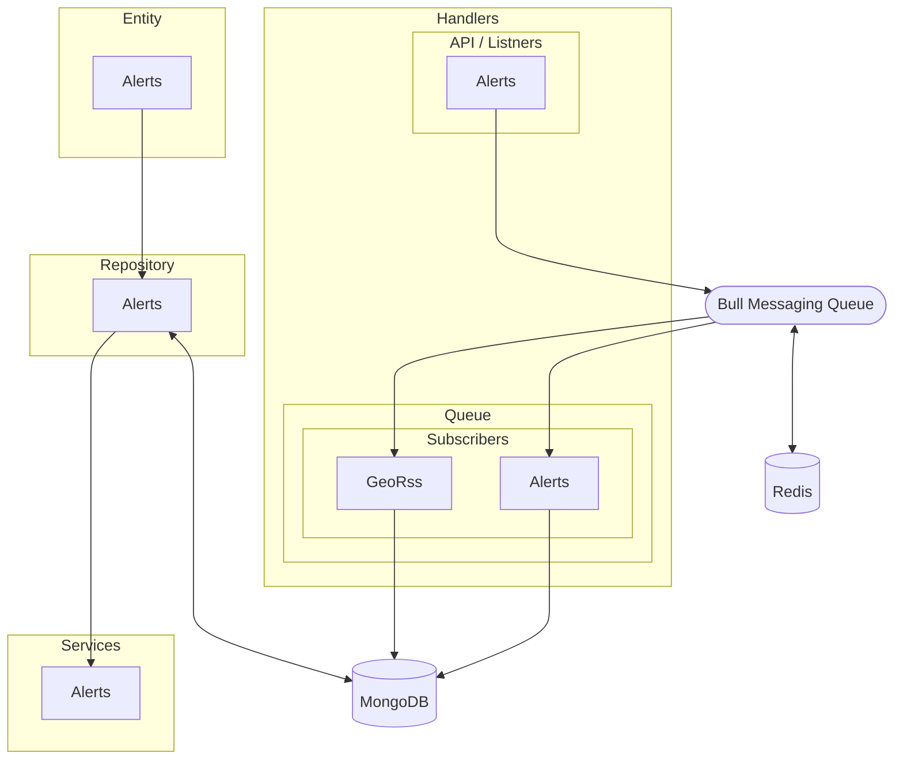

# Alerts System

The National Alert Aggregation and Dissemination (NAAD) System collects public alerting messages from Authorized Government Agencies (AGA) and makes them available to Last Mile Distributors (LMD) such as radio and television stations, as well as cable and satellite TV companies for display to Canadians, thereby helping forewarn the Canadian public of any imminent danger related to persons or property. This User Manual will provide the information needed for interested LMDs to receive and efficiently monitor alert messages disseminated through the NAAD system.

More context

- https://alerts.pelmorex.com/
- https://dd.alpha.meteo.gc.ca/alerts/doc/
- https://alerts.pelmorex.com/wp-content/uploads/2022/07/List-of-Event-Codes-for-Broadcast-Immediate-Alerts_version-2.1.pdf
- https://www.publicsafety.gc.ca/cnt/mrgnc-mngmnt/mrgnc-prprdnss/npas/clf-en.aspx
- https://www.publicsafety.gc.ca/cnt/mrgnc-mngmnt/mrgnc-prprdnss/npas/rchvd/clf-lng-12-en.aspx

## Documentation

Please find the api documentation at path `{url}/docs`

## Getting Started

These instructions will get you a copy of the project up and running on your local machine for development and testing purposes.

### Prerequisites

What things you need to install the software and how to install them.

- [Docker](https://www.docker.com/)
- [Node.js](https://nodejs.org/)
- [npm](https://www.npmjs.com/)

### Installing

A step by step series of examples that tell you how to get a development environment running.

1. Clone the repository.
2. Install dependencies.
3. Start the application.

This will start the Node.js application and listen for incoming connections on port 3000.

4. Run tests.

This will run the test suite for the application.

### Running with Docker

To run the application using Docker, you can use the included `Dockerfile` and `docker-compose.yml` files.

1. Build the Docker image.

This will start the Docker container and listen for incoming connections on port 3000.

Alternatively, you can use `docker-compose` to start both the Node.js application and a Redis server.

This will start the Node.js application and a Redis server using the `docker-compose.yml` file.

### Configuration

You can configure the application using environment variables. The following variables are available:

- `PORT`: The port number to listen on (default: 3000).
- `MONGO_URL`: The URL of the MongoDB server to connect to (default: mongodb://localhost:27017/my-database).
- `REDIS_URL`: The URL of the Redis server to connect to (default: redis://localhost:6379).
- `REDIS_PASSWORD`: The password to use when connecting to Redis (default: none).

## Built With

- [Node.js](https://nodejs.org/)
- [Express](https://expressjs.com/)
- [MongoDB](https://www.mongodb.com/)
- [Redis](https://redis.io/)
- [Docker](https://www.docker.com/)

## License

This project is licensed under the MIT License - see the [LICENSE.md](LICENSE.md) file for details.

## System Architecture

